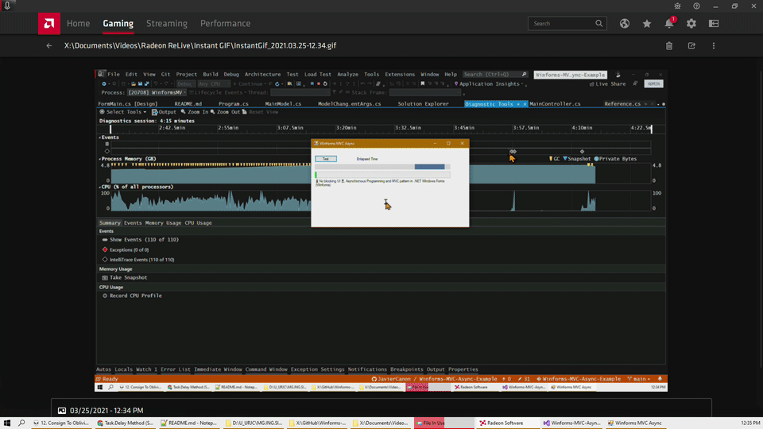

# Winforms-MVC-Async-Example
⌛ No blocking UI ⏳, Asynchronous Programming and MVC pattern in .NET Windows Forms (Winforms)

 

--- 
## Technology and Frameworks Used

* Microsoft Visual Studio 2019
* Microsoft .Net 4.8 Windows Forms
* Devexpress Winforms Controls

## Main Features

- [x] No blocking the UI for long tasks
- [x] Async programming
- [x] MVC pattern

## When Use Windows Forms?

Windows Forms is the original platform for managed Windows applications with a lightweight UI model and access to .NET Core or the full .NET Framework. It excels at enabling developers to quickly get started building applications, even for developers new to the platform. This is a forms-based, rapid application development platform with a large built-in collection of visual and non-visual drag-and-drop controls. Windows Forms does not use XAML, so deciding later to extend your application to UWP entails a complete re-write of your UI.

- [x] Rapid application development
- [x] WYSIWYG editor for building UI
- [x] Large collection (100's) of controls from Microsoft and partners (Devexpress, Telerik, Infragistic, etc.)
- [x] Dense UI
- [x] Support for Windows 7
- [x] Keyboard and mouse input
- [x] Direct access to all files on disk
- [x] ADO.NET, intensive Data
- [x] Existing code-base class libraries that use non-.NET Standard or non-Windows App Certification Kit compliant APIs
- [x] Local network loopback support (that is, if your app needs to communicate with localhost without creating a loopback exemption on the target device)
- [x] Intensive file I/O

### When NOT is Recommended Use Windows Forms?

- [x] Customizable UI
- [x] Rich graphics and user experiences (such as touch and animations)
- [x] Rich abstraction of views and data models

- [Choose your platform](https://docs.microsoft.com/en-us/windows/apps/desktop/choose-your-platform)

## Philosophy of Javier Cañon

* KISS by design and programming. An acronym for "keep it simple, stupid" or "keep it stupid simple", is a design principle. The KISS principle states that most systems work best if they are kept simple rather than made complicated; therefore, simplicity should be a key goal in design, and unnecessary complexity should be avoided. Variations on the phrase include: "Keep it simple, silly", "keep it short and simple", "keep it simple and straightforward", "keep it small and simple", or "keep it stupid simple".
* Select the best tools for the job, use tools that take less time to finish the job.
* Productivity over complexity and avoid unnecessary complexity for elegant or beauty code.
* Computers are machines, more powerful every year, give them hard work, concentrate on being productive.
* Often people, especially computer engineers, focus on the machines. They think, "By doing this, the machine will run fast. By doing this, the machine will run more effectively. By doing this, the machine will something, something, something..." They are focusing on machines. But in fact we need to focus on humans, on how humans care about doing programming or operating the application of the machines. We are the masters. They are the slaves. [Yukihiro Matsumoto].

## Authors

* **Javier Cañon** - *Initial work* - [www.JavierCanon.com](https://javiercanon.com)

## License

This project is licensed under the MIT LICENSE - see the [LICENSE.md](/LICENSE.md) file for details.

---
Made with ❤️ by **[Javier Cañon](https://javiercanon.com)**.